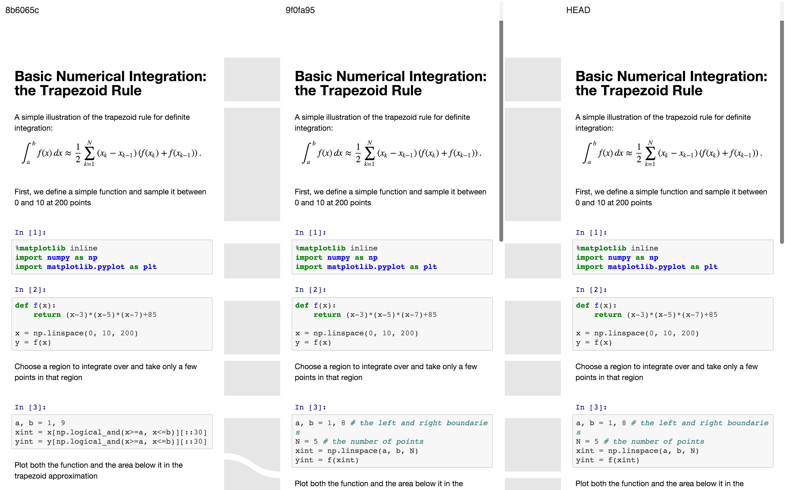

## nbdiffstream
> Proof-of-Concept visual diff for Jupyter Notebooks


## Screenshot/Demo
[](https://rawgit.com/bollwyvl/nbdiffstream/gh-pages/index.html)


## Motivation
Visual diff is even more important with mixed content documents like
Jupyter Notebooks than source code. Source code, rich text, raster images,
discrete vector visualizations, and interactive explorations each have
different characteristics but contribute to the overall impact of the
document.

Building on the great work of [meld](http://meldmerge.org/) and others, but
taking cues from the data visualization, with `nbdiffstream` a user should be
understand the complete history of a Notebook.


## Implementation
Any number of linear versions of a notebook are loaded in `iframe` tags.

When each DOM is ready (and after a kludgy delay to allow for slow assets
(always looking at you, MathJax) each `iframe` DOM is interrogated to pull out
the screen geometry of the input and output areas, which are stored in a  
[Baobab](https://github.com/Yomguithereal/baobab) tree.

`iframe`s are gross, but are the only approach that will scale to full, live
notebooks, with their own widgets, etc.

Between each pair of versions, an `svg` is created with
[d3](https://github.com/mbostock/d3) that shows both the structure and
(eventually) underlying change stream between versions.

The actual patches are assumed to be expensive to generate, and as such are
each fetched separately into the tree.

Scrolling always tries to keep the cell part currently in the middle of the
scrolled pane centered in the other panes.

The proof of concept at least uses `requirejs`, but is intentionally
boring-old-ES5 for ease of rapid prototyping.

## Roadmap
> Sort of in order

- [x] side-by-side notebook structure visualization of n versions (PoC: 3)
- [x] "waterline" synced scrolling
- [ ] handle screen resize
- [ ] remove hardcoded notebooks from code, parse from URL `#` fragment
- [ ] `img`/`canvas` diff
- [ ] handle cell (part) add/remove...
  - [ ] merge? copy?
  - [ ] search
- [ ] find DOM associated with `nbdime` diff stream
  - [ ] update stream svg with more arcs/colors to indicate add/replace
  - [ ] add overlays on changed DOM
  - [ ] add secondary overlay on changed words
  - [ ] ignore whitespace
- [ ] collapse panes
- [ ] expand diff for overlay/unified diff
- [ ] replace native scrollbars with document map
- [ ] `git blame`-style user/date information
- [ ] productionize as nodejs/python project
  - [ ] css/js build/automation
  - [ ] tests
  - [ ] documentation
- [ ] integrate 3rd-party applications
  - [ ] bokeh
    - [ ] synced events
  - [ ] nbpresent
  - [ ] RISE/reveal.js?
- [ ] integrate into downstream Jupyter projects
  - [ ] add diff view to live notebook?
    - [ ] integrate with codemirror
    - [ ] widgets
  - [ ] add diff view to nbviewer
    - [ ] github repo


## Try It Locally
The preferred method uses `npm`:
```bash
npm install
npm run live
```

Or the good ol'
```bash
python -m http.server
```

or legacy python

```bash
python -m SimpleHTTPServer
```
